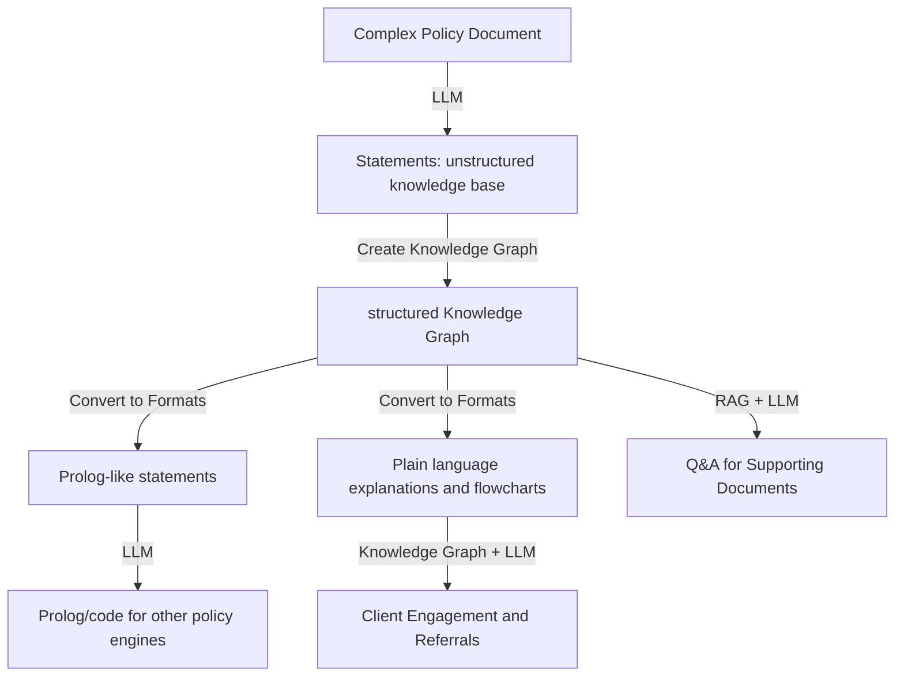

# Policy2Code-2024Docs
Documents of our project in policy2code challenge 2024

Breaking Down Complex Policy Documents using LLM and Knowledge Graph
## Overview

The goal of this project is to use Large Language Models (LLMs) to break down complex policy documents into manageable pieces, creating a bottom-up definition of rules and consequences. This will enable the creation of a knowledge graph, which can be converted into various formats for different use cases.

## Step 1: Breaking Down Policy Documents using LLM

- Input: Complex policy document
- Process: Use LLM to analyze and break down the policy document into individual statements
  - Chunk documents by lines and group them 3 by 3
  - Using knowledge extraction prompt downloaded from langchain community to extract knowledge keypoints from chunk
  - Use LLM to iterate over all keypoints to remove keypoints that already have record in memory and write new statements to add into memory
- Output: Collection of statements that form the building blocks of the policy

## Step 2: Creating the Knowledge Graph

- Input: Collection of statements from Step 1
- Process: Use the statements to create a knowledge graph, defining rules and consequences
- Output: Knowledge graph representing the policy rules and consequences

## Step 3: Converting Knowledge Graph to Various Formats

- Input: Knowledge graph
- Process: Convert the knowledge graph into various formats:
  - Prolog-like statements (facts and rules) for inference
  - Plain language explanations and flowcharts for client engagement and eligibility determination
- Output:
  - Prolog-like statements (facts and rules)
  - Plain language explanations and flowcharts

## Use Cases
### 1. Q&A and Supporting Documents

- Input: Prolog-like statements (facts and rules)
- Process: Use RAG (Reasoning and Argumentation) + LLM to answer questions and generate supporting documents for lawyers and social workers
- Output: Answers and supporting documents

### 2. Client Engagement and Referrals

- Input: Plain language explanations and flowcharts
- Process: Use knowledge graph + LLM to generate plain language explanations and flowcharts for client engagement, and provide referrals to lawyers/social workers
- Output: Plain language explanations and flowcharts, referrals to lawyers/social workers

### 3. Compatibility and Scalability

- Input: Prolog-like statements (facts and rules)
- Process: Use LLM to generate prolog/code for other policy engines, ensuring compatibility and scalability of the ecosystem
- Output: Prolog/code for other policy engines

## UML Diagram

Here is a simplified UML diagram illustrating the process:

